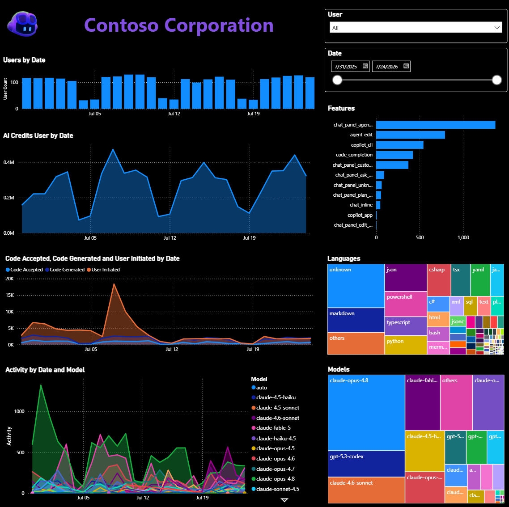
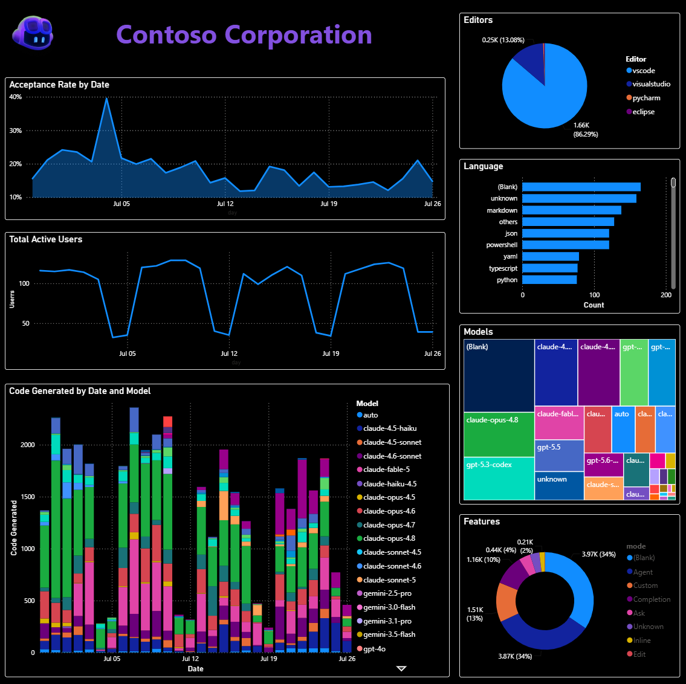
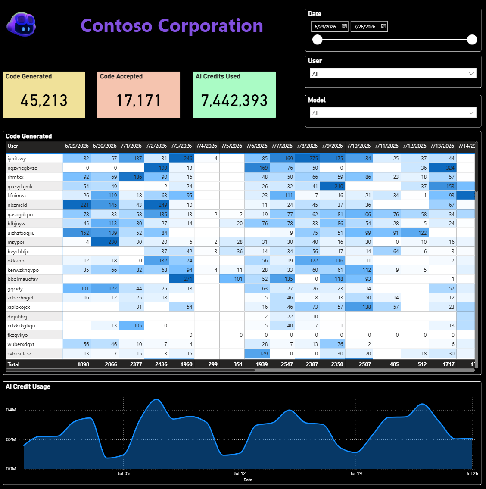
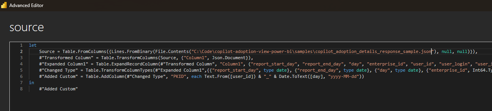

# 🚀 GitHub Copilot Adoption Analytics Dashboard

Welcome to your comprehensive GitHub Copilot adoption analytics dashboard! This Power BI dashboard helps you visualize and understand how your team is adopting GitHub Copilot across your organization.

📢 **Learn More**: Check out the [official GitHub announcement](https://github.blog/changelog/2025-10-28-copilot-usage-metrics-dashboard-and-api-in-public-preview/) about the Copilot usage metrics dashboard and API now in public preview!

> **🔬 Beta Version Notice**: This dashboard uses GitHub's beta Copilot metrics API, which is currently being refined and enhanced. Features and data structure may evolve as GitHub continues to improve the API. Stay tuned for updates! 

## 📸 Dashboard Preview


*Main overview dashboard showing key adoption metrics*


*Detailed activity breakdown by users and features*


*Individual user activity patterns and trends*

## 🎯 What This Dashboard Shows

This dashboard provides insights into:

- 📈 **Overall Copilot Usage Trends** - Track adoption over time
- 👥 **User Engagement Metrics** - See who's using Copilot and how
- 💻 **IDE and Feature Usage** - Understand which tools and features are most popular
- 🌍 **Language and Model Analytics** - Analyze usage by programming language and AI model
- 📊 **Code Generation & Acceptance Rates** - Measure productivity impact
- 🤖 **Agent vs Chat Usage** - Compare different Copilot interaction modes

## 🔧 Setting Up Your Data Source

### Step 1: Get Your Copilot Metrics Data

First, you'll need to retrieve your organization's Copilot usage data using the GitHub API. The data should be in JSONL format (JSON Lines), where each line represents a user's daily usage metrics.

**API Endpoint**: 
```
/enterprises/{enterprise}/copilot/metrics/reports/enterprise-28-day/latest
```

📚 **API Reference**: [GitHub Copilot API Endpoints](https://docs.github.com/en/enterprise-cloud@latest/rest/copilot/copilot-usage-metrics?apiVersion=2022-11-28#get-copilot-enterprise-usage-metrics)

### Step 2: Configure Power BI Data Source

1. **Open the Power BI File** 📂
   - Open `samples/GitHub Copilot - Adoption Details.pbix` in Power BI Desktop

2. **Update the JSON Source** ⚙️
   - Go to **Home** and click → **Transform Data**
   - Click on **source** on the left hand side under **Queries**
   - Select **Advanced Editor** in the top menu
   - Update the source path to point to your JSON data:
   
   - Click **Done** and then **Close & Apply** to save your changes.

### Step 3: Refresh Your Dashboard

1. **Initial Data Load** 📊
   - Click **Refresh** to load your data
   - Verify that all visualizations populate correctly

## 📊 Understanding the Metrics

- **Detailed Metrics Guide**: [Interpreting GitHub Copilot Metrics](https://docs.github.com/en/enterprise-cloud@latest/early-access/copilot-metrics/dashboards/interpreting-the-metrics)
- **API Reference**: [GitHub Copilot API Endpoints](https://docs.github.com/en/enterprise-cloud@latest/rest/copilot/copilot-usage-metrics?apiVersion=2022-11-28#get-copilot-enterprise-usage-metrics)


## 🛠️ Troubleshooting

### Common Issues

1. **❌ Data Not Loading**
   - Verify JSON file path and format
   - Check authentication credentials
   - Ensure proper API permissions

2. **📊 Missing Visualizations**
   - Confirm all required fields are present
   - Check data type mappings
   - Verify relationships between tables

3. **🔄 Refresh Errors**
   - Validate JSON structure matches expected schema
   - Check for network connectivity (web sources)
   - Review error messages in Power Query

### Data Validation

Use the sample data in `samples/copilot_adoption_details_response_sample.json` to test your dashboard configuration before connecting to live data.

## 🚀 Getting Started Checklist

- [ ] 📥 Download your Copilot metrics data from GitHub API
- [ ] 🔧 Open Power BI file and configure data source
- [ ] 📊 Refresh data and verify dashboard loads
- [ ] 🎨 Customize visualizations for your needs
- [ ] ⏰ Set up scheduled refresh (Power BI Service)
- [ ] 📤 Share with your team!

## 🎉 Happy Analyzing!

Your GitHub Copilot adoption dashboard is now ready to provide valuable insights into how your team is leveraging AI-powered coding assistance. Use these metrics to:

- 🎯 Identify power users and champions
- 📚 Plan training and adoption strategies  
- 📈 Measure ROI and productivity impact
- 🔍 Optimize development workflows

Remember, this is a beta API, so stay flexible and check for updates regularly! 🌟

## 🔒 Data Anonymization for Demos

Use the included `anonymize.py` script to create demo-safe versions of your Copilot metrics data. It replaces real user IDs and usernames with anonymous ones while preserving all usage metrics and patterns. Simply run `python anonymize.py` after updating the file paths in the script.

> **🛡️ Privacy Note**: Always use anonymized data for demos and external sharing!
