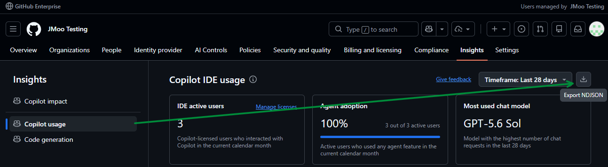
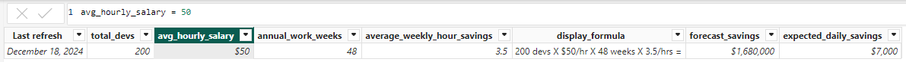
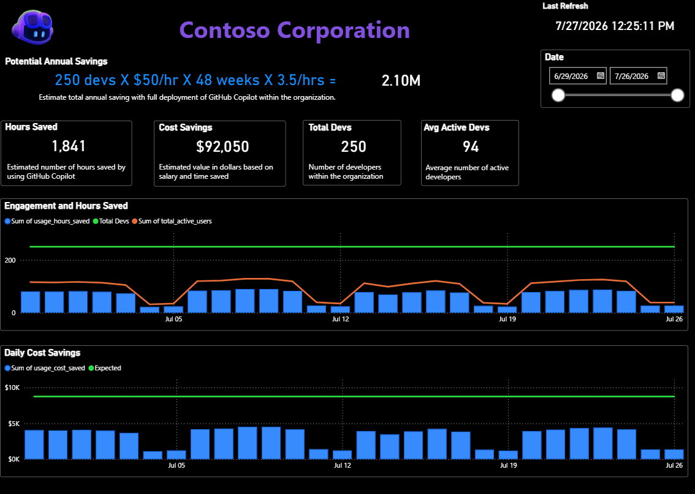

# 🚀 GitHub Copilot Adoption Analytics Dashboard

Welcome to your comprehensive GitHub Copilot adoption analytics dashboard! This Power BI dashboard helps you visualize and understand how your team is adopting GitHub Copilot across your organization.

💳 **New: AI Credits Tracking!** The dashboard now includes AI credits analytics, giving you visibility into AI credit consumption across your organization so you can monitor usage, manage budgets, and understand the cost dynamics of Copilot adoption alongside your existing engagement and savings metrics.

📢 **Learn More**: Check out the [official GitHub announcement](https://github.blog/changelog/2025-10-28-copilot-usage-metrics-dashboard-and-api-in-public-preview/) about the Copilot usage metrics dashboard and API now in public preview!

**🔬 Beta Version Notice**: This dashboard uses GitHub's Copilot metrics API, which is currently being refined and enhanced. Features and data structure may evolve as GitHub continues to improve the API. Stay tuned for updates! 

## 📸 Dashboard Preview

**🆕 New: KPI Dashboard Added!** A new KPI dashboard has been added to the Power BI report, surfacing high-level business metrics such as Potential Annual Savings, Hours Saved, Cost Savings, Total Devs, and Avg Active Devs, along with Engagement and Daily Cost Savings trends.


*Main overview dashboard showing key adoption metrics*


*Detailed activity breakdown by users and features*


*Individual user activity patterns and trends*

## 🎯 What This Dashboard Shows

This dashboard provides insights into:

- 📈 **Overall Copilot Usage Trends** - Track adoption over time
- 👥 **User Engagement Metrics** - See who's using Copilot and how
- 💻 **IDE and Feature Usage** - Understand which tools and features are most popular
- 🌍 **Language and Model Analytics** - Analyze usage by programming language and AI model
- 📊 **Code Generation & Acceptance Rates** - Measure productivity impact
- 🤖 **Agent vs Chat Usage** - Compare different Copilot interaction modes

## 🔧 Setting Up Your Data Source

### Step 1: Get Your Copilot Metrics Data

First, you'll need to retrieve your enterprise's Copilot usage data by downloading it from the GitHub Enterprise portal or using the GitHub REST API. This dashboard uses the **latest 28-day users usage metrics** report.

#### **GitHub Portal**
**Log in to GitHub Enterprise** and navigate to Insights | Copilot usage to download the latest 28-day users usage metrics report in NDJSON format.


#### **API Endpoint**
**How it works**: This endpoint does **not** return the metrics directly. Instead, it returns a JSON response containing `download_links` (signed URLs), a `report_start_day`, and a `report_end_day`. Download the report file(s) from the `download_links` to get the NDJSON data used by this dashboard.

```
GET /enterprises/{enterprise}/copilot/metrics/reports/users-28-day/latest
```

**🔑 Access & permissions**: The "Copilot usage metrics" policy must be set to **Enabled everywhere** for the enterprise. Enterprise owners, billing managers, and users with the fine-grained "View Enterprise Copilot Metrics" permission can access this endpoint. OAuth app tokens and personal access tokens (classic) need either the `manage_billing:copilot` or `read:enterprise` scope. Reports are available starting from October 10, 2025, and up to 1 year of historical data can be accessed.

📚 **API Documentation**: [REST API endpoints for Copilot usage metrics](https://docs.github.com/en/enterprise-cloud@latest/rest/copilot/copilot-usage-metrics?apiVersion=2026-03-10#get-copilot-users-usage-metrics)

### Step 2: Configure Power BI Data Source

1. **Open the Power BI File** 📂
   - Open `samples/GitHub Copilot - Adoption Details.pbix` in Power BI Desktop

2. **Update the JSON Source** ⚙️
   - Go to **Home** and click → **Transform Data**
   - Click on **source** on the left hand side under **Queries**
   - Select **Advanced Editor** in the top menu
   - Update the source path to point to your JSON data:
   
     Alternatively, update the report to pull data dynamically.  Please note that this example assumes just one download link.

     ```powerquery
     let
         // Replace <YOUR-TOKEN> and <ENTERPRISE> with your actual token and enterprise name.
         url = "https://api.github.com/enterprises/<ENTERPRISE>/copilot/metrics/reports/users-28-day/latest",
         headers = [
             #"Accept" = "application/vnd.github+json",
             #"Authorization" = "Bearer <YOUR-TOKEN>",
             #"X-GitHub-Api-Version" = "2026-03-10"
         ],
         Metrics = Json.Document(Web.Contents(url, [Headers=headers])),
         ReportUrl = Metrics[download_links]{0},
         Report = Web.Contents(ReportUrl),
         Source = Table.FromColumns({Lines.FromBinary(Report, null, null)}), 
     ```
    
   - Click **Done** and then **Close & Apply** to save your changes.

### Step 3: Refresh Your Dashboard

1. **Initial Data Load** 📊
   - Click **Refresh** to load your data
   - Verify that all visualizations populate correctly

## 📊 Understanding the Metrics

- **Detailed Metrics Guide**: [GitHub Copilot usage metrics](https://docs.github.com/en/enterprise-cloud@latest/copilot/reference/copilot-usage-metrics)
- **API Reference**: [REST API endpoints for Copilot usage metrics](https://docs.github.com/en/enterprise-cloud@latest/rest/copilot/copilot-usage-metrics?apiVersion=2026-03-10#get-copilot-users-usage-metrics)

## Collect Feedback on GitHub Copilot Usage

[](https://github.com/github-copilot-resources/copilot-metrics-viewer-power-bi#collect-feedback-on-github-copilot-usage)

To better understand how GitHub Copilot is being used in your organization and to help determine accurate time and cost savings, we recommend collecting direct feedback from your developers. This information can be used to refine the values in the KPI dashboard and ensure your savings estimates reflect real-world usage.

You can use the following**Microsoft Forms**template to gather feedback. Simply duplicate the form and customize it for your organization:

[GitHub Copilot Usage Feedback – Microsoft Forms Template](https://forms.office.com/Pages/ShareFormPage.aspx?id=v4j5cvGGr0GRqy180BHbR6zql0pB1xhIi5wwWWSq6RVUQ0JQSkZOMElYOFdHWUFWWVhPRllTQ1ZRUi4u&sharetoken=Gb49retb5qghvCQiQILO)

Gathering this feedback will help you:

-   Validate or adjust the average weekly hour savings.
-   Understand adoption and satisfaction.
-   Support your ROI calculations with real user data.

Feel free to adapt the form to include any additional questions relevant to your team.

## KPI - Savings Dashboard
A new KPI tab has been added to the dashboard to help you estimate savings. The KPI tab is configured to display the potential time and cost savings. You can configure the KPI tab to display these details by modifying the following fields in the`config`data source from the**Table view**:

| Name | Description |
| :-- | :-- |
| total\_devs | Total number of developers at your organization. |
| avg\_hourly\_salary | Average hourly salary of developers. |
| annual\_work\_weeks | Total number of work weeks in a year. |
| average\_weekly\_hour\_savings | Average number of hours developers saved per week. The default is 3.5 hours and assumed a 10% time saving, but this can be updated based on customer survey data or other measurements. |

These values can be modified in the`config`data source below:

Once configured, the KPI dashboard will display this potential savings against current usage pulled from the Metrics API: 

## 🛠️ Troubleshooting

### Common Issues

1. **❌ Data Not Loading**
   - Verify JSON file path and format
   - Check authentication credentials
   - Ensure proper API permissions

2. **📊 Missing Visualizations**
   - Confirm all required fields are present
   - Check data type mappings
   - Verify relationships between tables

3. **🔄 Refresh Errors**
   - Validate JSON structure matches expected schema
   - Check for network connectivity (web sources)
   - Review error messages in Power Query

### Data Validation

Use the sample data in `samples/copilot_adoption_details_response_sample.json` to test your dashboard configuration before connecting to live data.

## 🚀 Getting Started Checklist

- [ ] 📥 Download your Copilot metrics data from GitHub API
- [ ] 🔧 Open Power BI file and configure data source
- [ ] 📊 Refresh data and verify dashboard loads
- [ ] 🎨 Customize visualizations for your needs
- [ ] ⏰ Set up scheduled refresh (Power BI Service)
- [ ] 📤 Share with your team!

## 🎉 Happy Analyzing!

Your GitHub Copilot adoption dashboard is now ready to provide valuable insights into how your team is leveraging AI-powered coding assistance. Use these metrics to:

- 🎯 Identify power users and champions
- 📚 Plan training and adoption strategies  
- 📈 Measure ROI and productivity impact
- 🔍 Optimize development workflows

Remember, this is a beta API, so stay flexible and check for updates regularly! 🌟

## 🔒 Data Anonymization for Demos

Use the included `anonymize.py` script to obfuscate your user Copilot metrics data. It replaces real user IDs and usernames with anonymous ones while preserving all usage metrics and patterns. Simply run `python anonymize.py` after updating the file paths in the script.

> **🛡️ Privacy Note**: Always use anonymized data for demos and external sharing!
